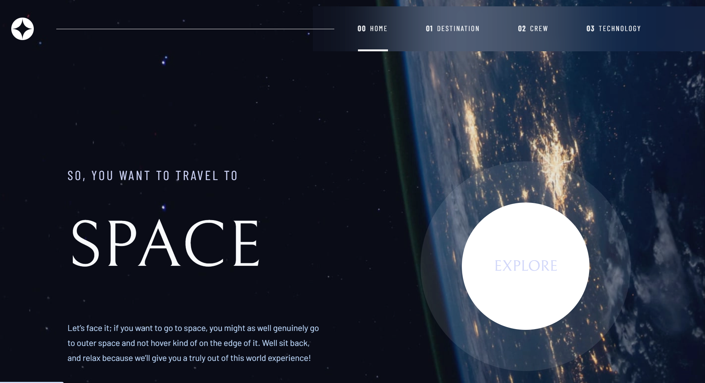

# Space Tourism Multi-Page Website

This is a multi-page website built with Next.js, React, and Tailwind CSS, designed to showcase an immersive space tourism experience. The project utilizes modern web development tools and practices, ensuring high performance, scalability, and maintainability.

## Installation

git clone https://github.com/your-username/space-tourism-multi-page-website.git  
cd space-tourism-multi-page-website

### Install dependencies:

```bash
npm install

```

### Usage

```bash
npm run dev

```

## Features

- Multi-Page Navigation: Seamless routing between pages using Next.js.
- Responsive Design: Fully optimized for desktops, tablets, and mobile devices.
- Tailwind CSS: Custom styling with utility-first classes.
- Prettier & ESLint: Enforces consistent code quality and styling.
- Developer-Friendly: Modern tools like PostCSS and Prettier make collaboration efficient.

## Technologies

- Next.js 15
- React 19
- Tailwind CSS 3.4
- Prettier with Tailwind Plugin
- ESLint

## Styling

This project is styled using Tailwind CSS. Classes are added directly to JSX elements for fast and maintainable styling.

## Screenshots





## Check it out

You can view the live project here: [Live Project](https://space-tourism-multi-page-website-teal.vercel.app/)

You can also find the source code here: [GitHub Repository](https://github.com/Tamar86/space-tourism-multi-page-website)
